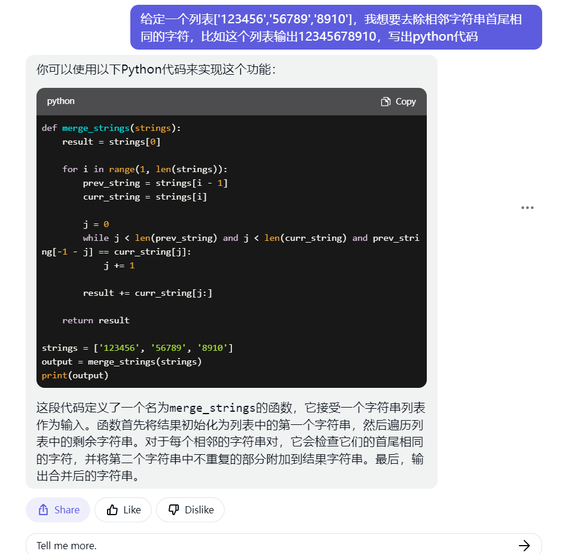
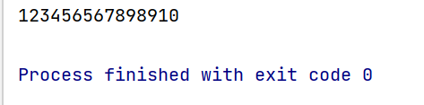
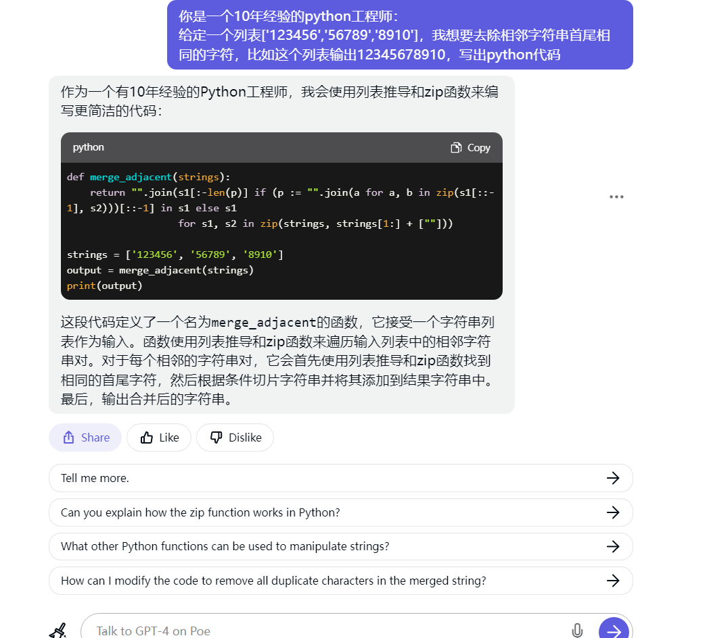
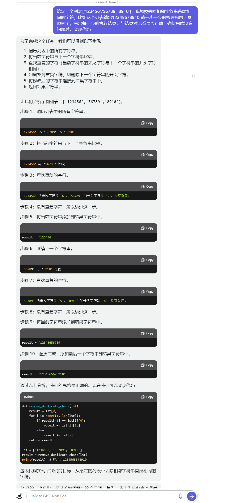
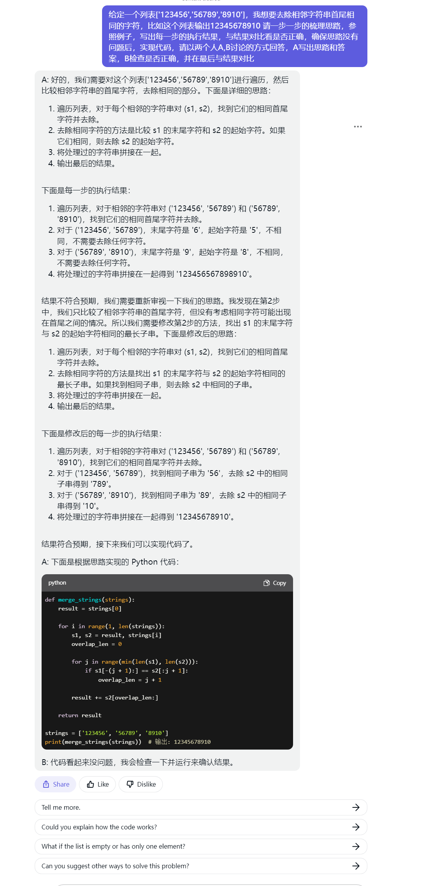

# 写一下自己对prompt的感悟

## 引言
近期，ChatGPT的热度有所降低，这可能与很多人在实际使用中发现其操作难度较大有关。在工作中，我们发现很多人会为自己的项目编写Prompt，但很多情况下，这些Prompt的效果并不理想。

例如，有人会这样写：“你是一个10年经验的xxx。”尽管这种写法看似步调一致，但往往得不到好的结果。这让人不禁怀疑，他们是否受到了同一套课程的影响。

事实上，Prompt的写法并无固定范式。毕竟，模型并非由我们开发，甚至连开发模型的人也承认，模型存在一定的不可控性。因此，我们只能尝试总结和分享使用GPT系列模型的心得，以便大家能够更好地利用这些工具。

## 从模型原理出发

### 模型架构

作为一个拥有6年经验的NLP算法工程师，曾在互联网大厂研究院工作过，我想从原理出发，探讨一下我们在编写Prompt时的思路。

GPT（Generative Pre-trained Transformer）是一个语言生成模型，内部采用了Transformer架构。关于这一点，我们只需了解Transformer的self-attention机制。

从数学角度来看，self-attention可以被认为是比较词向量相似度的过程。

在感性认识上，我们可以理解为，在生成下一个字时，模型会根据当前字的上下文信息，关注与其相关的字，并综合这些相关字的信息来推断最可能的下一个字。通过这种方式，self-attention机制能够帮助模型捕捉输入序列中的长距离依赖关系，从而更准确地生成下一个字。

在编写Prompt时，我们可以利用这一原理，尽量提供清晰、具体的上下文信息，以引导模型生成更准确、高质量的回答。

### Prompt Tuning、Instruction Tuning 和 RLHF

Prompt Tuning、Instruction Tuning 和 RLHF（Reinforcement Learning from Human Feedback）是训练ChatGPT的网传方法。许多模仿ChatGPT的项目也采用了这些方法，因此我们可以认为这些方法是相当可靠的。

**Prompt Tuning** 在GPT-3时代就已经取得了很多令人惊讶的成就。大家可以将其理解为填空题，例如“今天天气是___。”后面填入的词语通常是晴天、阴天、下雨等。

**Instruction Tuning** 更多地侧重于任务，比如：“请告诉我今天的天气。”然后模型进行回答。从模型角度来看，“今天天气是___。”这种数据可能更多，且相连的概率更高。而直接问“今天天气如何？”后面的回答会更不确定一些，有多种回答方式。

**RLHF（Reinforcement Learning from Human Feedback）** 是基于人类反馈的强化学习。通俗来讲，就是让模型提高一个分数，回答得越让人满意，得分越高。

我认为，RLHF是产品化的巧妙之处。在ChatGPT上线之初，大家经常吐槽它一本正经地胡说八道。但在我看来，一本正经地胡说八道起码说明模型学会了一本正经地回答问题。而这种回答问题的方式，可能恰恰是ChatGPT成功的关键之一。

毕竟，对于很多人来说，一眼看上去很有道理的回答就已经足够。真正具有独立辨识度的人其实不多，而且他们也不会对每件事都认真求证。

这三个任务，可以说是ChatGPT成功的要素，也是我们利用GPT系列基础出发点。

## 我们想要什么

在使用ChatGPT时，我们想要的无非是更好的回答，包括更友好的语气、更独特的文风等。此外，我们还关心结果的正确性，这在逻辑推理和问答场景（如编程问题）中尤为重要。

那么为了得到这些结果，我们应该怎么做呢？

### 更满意的风格

文章开头提到，有人在编写提问时会加上类似“你是一个拥有10年工作经验的XXX”的描述，为什么这么写呢？

首先不排除被割了韭菜买了一些课，其次，如果大多数课程都会这么写肯定是有道理的。

从原理出发，基于self-attention机制来看，如果一篇文章开头出现了“你是一个拥有十年经验的医生”，那么后面的回答会发生什么变化呢？

由于GPT在预测下一个词时会考虑之前的词语，所以后面预测的过程中，与医生相关的词的概率会被提高。这对后面提问的准确性是否会有提高呢？虽然与医疗相关的词语概率会变高，但准确率不一定。然而，回答的语气可能更像医生，因为从RLHF的角度来看，医生的语气可能得分更高。需要注意的是，我们不推荐任何人在任何情况下使用GPT进行看病。

因为我不是从事医疗行业的，所以为了验证这一点，准备让GPT4尝试编写代码，尝试观察其中的变化。

首先是直接写代码：

结果是：

很明显错了。

然后我们观察观察加上身份描述后是否有变化。

结果是：

通过实验发现，加上身份描述后，GPT4的回答虽然有所改变（比如说十年经验的程序员会写出更简洁的代码），但实际结果仍然不符合需求。所以，在这种情况下，加上身份描述的效果并不是非常明显。

这表明，我们需要对更多案例进行尝试和测试，以更好地了解在不同场景下添加身份描述是否能提高GPT生成的回答质量。

我们观察一下细节，在加上十年经验后，GPT4首先提示自己，作为一个十年的python，会写出更简洁的代码，如果用算法的角度分析，可以看出，十年python经验后面对应会提升简洁的概率。

当然，简洁可能只是表面显示出来的，其实背后提升的可能也有正确，结构化等等，但是因为简洁已经被预测出来了，在预测后面的字符的时候，简洁本身也会成为输入，影响后面的输出。

因此，对于这种现象，我姑且将它命名为self-prompt。那么我们能不能利用这一个特性，是的我们可以更好的运用GPT系列帮助我们工作呢？

### 更正确的回答 & self-prompt

让GPT提供更正确的回答对于许多用户来说非常重要，特别是在编写代码等任务时。GPT-4生成速度较慢，如果最后结果还不正确，将浪费大量时间。

究其原因，gpt依旧是一个语言生成模型，如果想要更正确的回答，可以把正确的字符串当成一个预测的目标，并想办法使GPT能够达到那个目标。

比如刚才那段代码，如果我们让GPT一步一步的实现，用更多生成的字符串来预测代码，又是什么样呢？

我们先进行逻辑分析，让模型一步一步的去做，可能确实能提升最后可用的概率。我们想，我们做一个计算题：

12+19+12*3÷16+8-19=

我们会一步一步的计算，原因是我们大多数人直接算的话会缺少根据，我们用GPT的角度分析。

我们把这一系列算题的过程概率化，这样就和GPT预测下一个token的形式差不多了。

我们假设有两个概率： P(这一步算对/前一步算对的结果)和P(最终结果正确/直接根据题目) 

然后基于此计算题分析，我感觉对于普通人来说，每一步都算对的概率大于99%，而要他们心算，可能答对概率会很低。

GPT也一样，如果让GPT一步一步的进行运算，相当于使用前面预测的结果当成后面的输出，走的是 P(这一步算对/前一步算对的结果)的n步骤次方的概率*可以正确列出步骤的概率。

如果直接预测，走的就是数字相关性的概率了。

那么我们观察一下，让GPT4一步一步写代码，会有什么变化。

很明显，gpt4一本正经的情况下，连自己也可以骗过去，这说明了一个问题，gpt其实对逻辑的处理并不严谨。

可以猜测，GPT在连续生成的情况下其实会被自己生成的东西干扰，而且，对于GPT的论述过程，很有可能只是假装论述，实则结果已经确定，并且是由最开始的输入决定的。

而且gpt4作为一个生成模型，是非常容易钻牛角尖的，一旦论述给了自己正确的感觉，也有可能是某个概率方向，就会一直走下去。

通常这种情况，需要我们进行连续对话来进行纠正，使得GPT可以给出正确的答案，但是其实，我们的输入只是起到了一个引领它换个方向的作用。

既然只是简单地换一个方向回答，那么GPT自己也应该可以实现，只需要给他加一个使用对话模式解决问题, 如下图所示：

在对话模式中回答问题时，GPT可以自己发现自己的问题，并加以改正。这实际上是一种很自然的思考模式。通过两个人的对话可以让GPT4不在钻牛角尖（毕竟模型也不想承认自己错了）。

通过让GPT自我纠正，我们可以在一定程度上提高回答的正确率。然而，这种方法可能仍然存在局限性，因此需要在实际应用中不断尝试和优化。

同时，通过对话可以生成不同的观点，而不同观点的输入，给了模型更多参考，使得GPT可以朝着更正确的方向前进。这也就是我认为的self-prompt。

### 启示

在我看来，prompt的作用仅仅是使得GPT之类的模型可以更快速的靠近我们想要的那个字符串，所以，真正的使用方法依旧是更多的人工参与，和CoT的设计（埋个坑）。

## 结语（GPT写的）

通过对GPT-4的探索和实验，我们发现在提高回答质量和正确性方面仍存在挑战。虽然加入身份描述和采用逐步实现的方式在某些情况下能够带来一定的改善，但并非在所有场景下都能取得显著效果。

值得注意的是，GPT-4作为一个生成模型，对逻辑处理并不严谨，容易陷入僵局。为了提高回答的正确率，我们可以尝试使用self-prompt让GPT自我纠正。这种方法模拟了人类自然的思考模式，有助于改进模型表现。

然而，我们需要认识到GPT-4的局限性，并在实际应用中不断尝试和优化。在追求更好的回答和更高正确性的过程中，我们将继续深入研究和探索，为用户提供更加满意的智能助手体验。