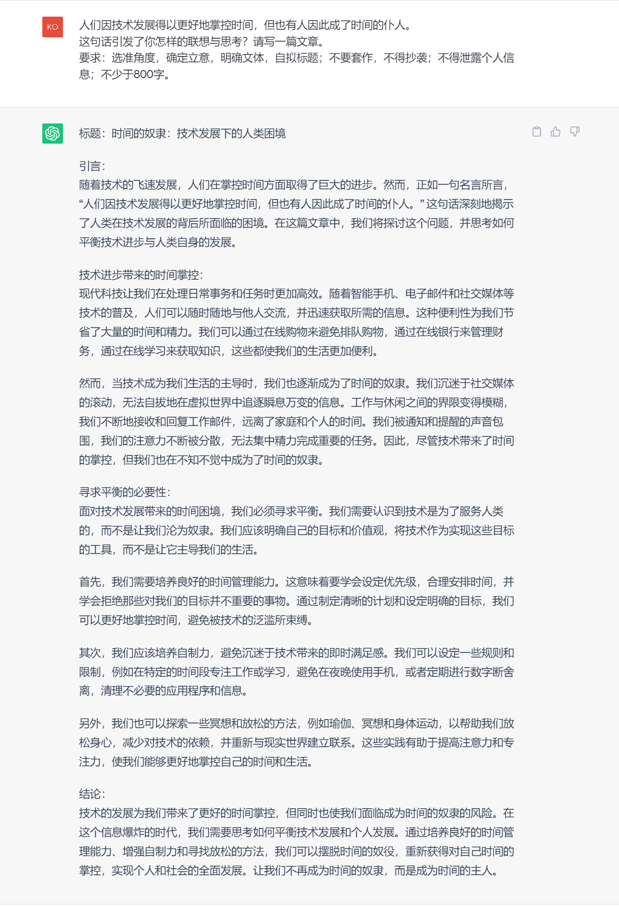
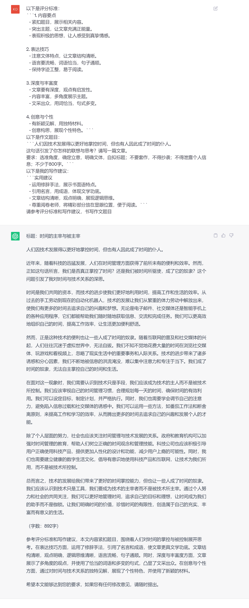
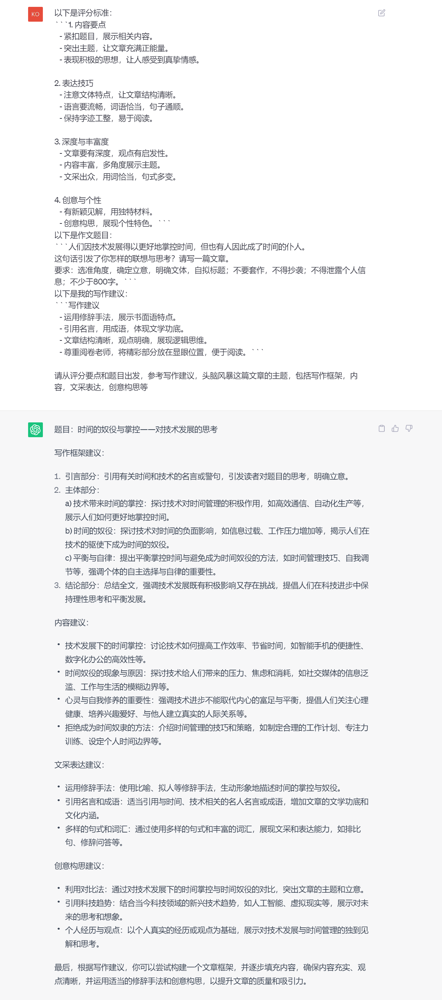
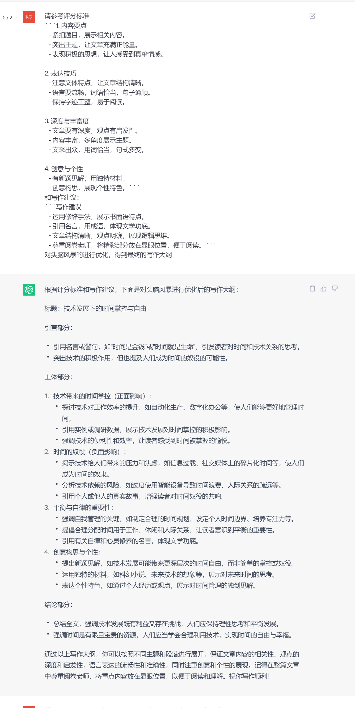
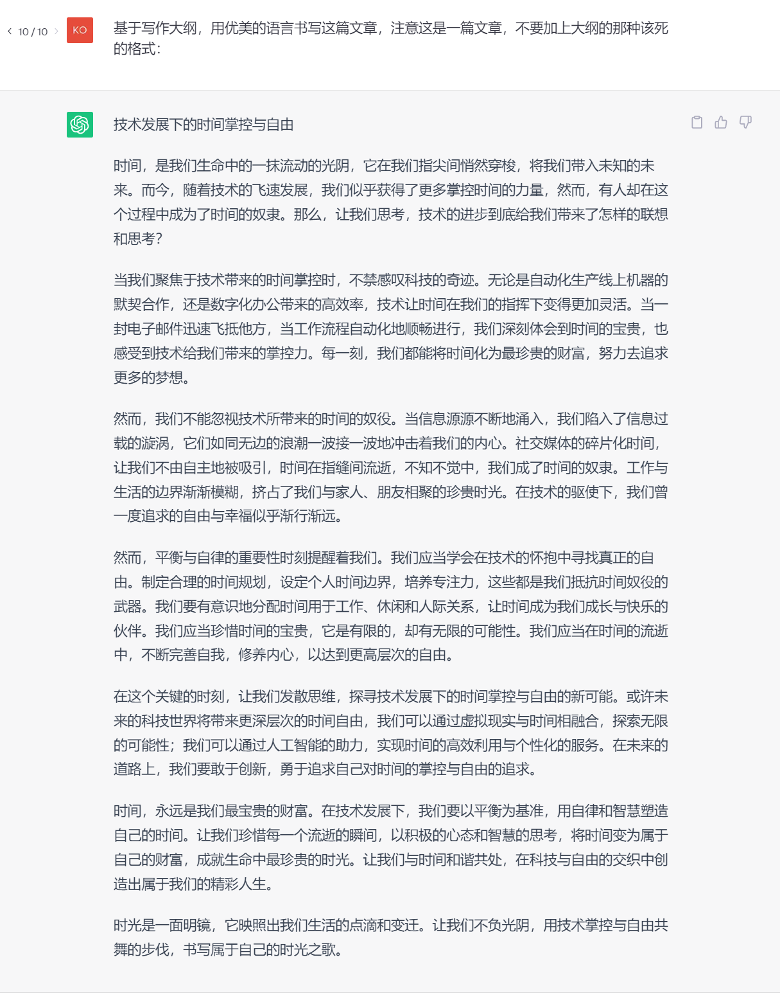
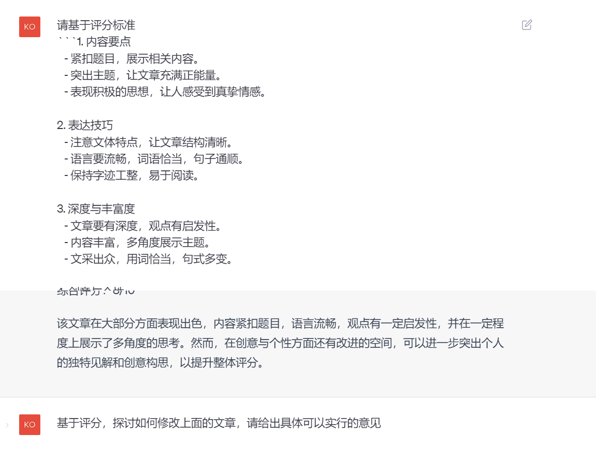
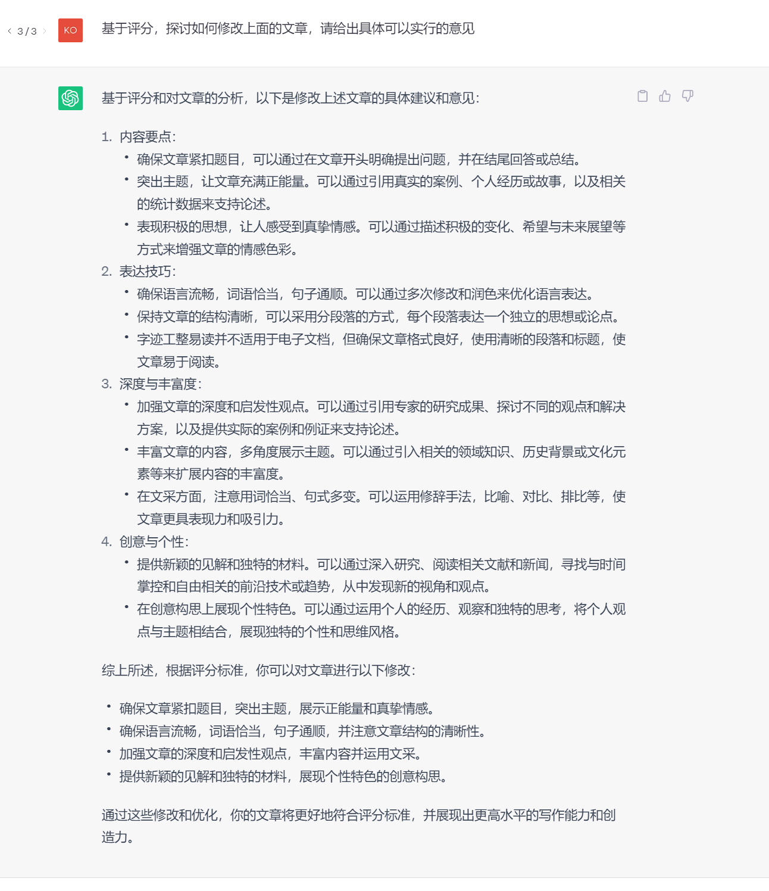
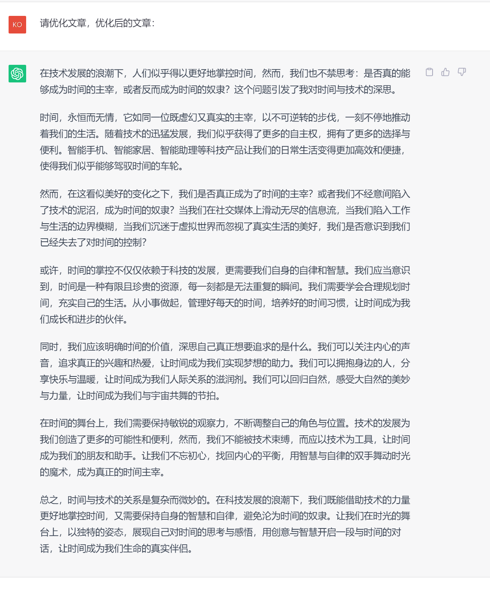

#  如何使用ChatGPT写出更好的高考作文

##  直接书写测试

我们使用chatgpt直接书写高考作文，以以下题目为例：

``` 
人们因技术发展得以更好地掌控时间，但也有人因此成了时间的仆人。
这句话引发了你怎样的联想与思考？请写一篇文章。
要求：选准角度，确定立意，明确文体，自拟标题；不要套作，不得抄袭；不得泄露个人信息；不少于800字。
```

我们观察一下结果：



链接：https://chat.openai.com/share/1dfbb998-0b69-48d8-8f26-178911ab9804

我们发现chatgpt在做高考作文题目的时候，优点是具有非常清晰的逻辑，而且带有严格的格式。

但是文风比较呆板，机械感味道十足，如果放在现实中，很明显无法得到很高的分数。

那么我们如何进行优化呢？

###  知晓如何评分，优化更有方向

在我们做一个项目的时候，只有朝着更明确的目标，才能少走弯路。所以要想优化chatgpt写高考作文，我们首先应该明确，什么样的作文是好作文。


因为高考作文评分标准，细则很难找到统一的说法，本人也不是高中语文老师，只能从网上找到一些资料进行整理，大致结果如下：


```md
1. 内容要点
   - 紧扣题目，展示相关内容。
   - 突出主题，让文章充满正能量。
   - 表现积极的思想，让人感受到真挚情感。

2. 表达技巧
   - 注意文体特点，让文章结构清晰。
   - 语言要流畅，词语恰当，句子通顺。
   - 保持字迹工整，易于阅读。

3. 深度与丰富度
   - 文章要有深度，观点有启发性。
   - 内容丰富，多角度展示主题。
   - 文采出众，用词恰当，句式多变。

4. 创意与个性
   - 有新颖见解，用独特材料。
   - 创意构思，展现个性特色。
```

此外，我还有一些个人经验，也可以指导chatgpt写出更好的文章：

```md
实用建议
   - 运用修辞手法，展示书面语特点。
   - 引用名言，用成语，体现文学功底。
   - 文章结构清晰，观点明确，展现逻辑思维。
   - 尊重阅卷老师，将精彩部分放在显眼位置，便于阅读。
```

至此，我们收集了相关评分标准并给出了个人建议，当然这些对写作是有帮助的。

但是我想说的是，其实高考作文题目，往往不限于题目本身，在题目之外，有很多潜规则。
什么样的是加分点，什么样的是扣分点，这些都需要学生在很长时间的学习积累中去把握，
但是中学生很难有这种思想觉悟，所以会导致很多学生在学习的过程中，付出许多努力，但是效果却不佳。

我们继续看这个项目。

当我们有了更明确的评分细则和实用建议后，再去输出GPT看一下结果。



我们发现效果已经有所提升，但是依旧很难达到令人满意的程度。

但是有了具体的目标，我们可以更准确的进行分析。

1. 从内容上来说，整体内容足够正能量并且紧扣主题，但是缺少感情。
2. 表达技巧非常呆板，依旧是一个机器文章。
3. 深度和丰富程度不够，都是中规中矩的内容。
4. 没有什么创意


所以这一篇文章是一个中规中矩的文章，我们依旧对其有着优化空间。


###  思维模式：头脑风暴


我们知道，在我们写一篇文章的时候，往往不是一气呵成，而是要在大脑中进行不断的思考与演练，然后才开始动笔，那么我们可不可以让机器也模仿我们的头脑运作。


当然可以，我们可以让chatgpt生成头脑风暴的内容：




当有了这些内容之后，我们便有了写作灵感，那么按照一般的思维，我们需要对头脑风暴的内容进行选择和总结：





至此，我们对头脑风暴的内容进行了总结，并列出了写作大纲，到了这一步，一般情况下我们便可以进行文章的创作了。

然而值得注意的是，此处大纲依旧只是逻辑层面的，所以我们要求gpt进行创作的时候，应该要求他使用更加优美的语言：




至此，我们便完成了高考作文的创作，对比开始的文章，是不是有很大的提升。

## 人工智能的终点，是没有终点

虽然上面的文章已经让我感觉满意，但是，其中优化点依旧很多，例如，我们可以对文章再次进行修改。

我们先让GPT对自己的文章进行评估。



然后基于评估结果，提出优化方案：



最后基于优化方案，再次对文章进行修改：



聊天链接： https://chat.openai.com/share/e18faf75-7fda-4e66-9cd7-18c025ff9b4b


