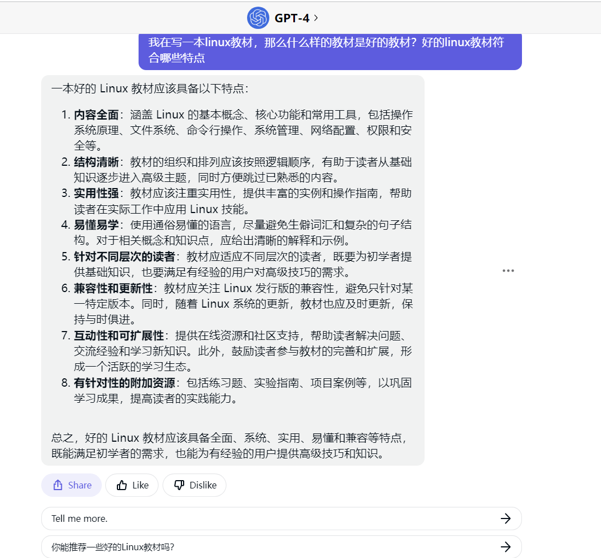

# 如何让GPT生成一本Linux教程

## 引言

在日常使用chatgpt帮助我进行工作的时候，我发现chatgpt在写代码上面可能会经常报错，但是在使用chatgpt查询和生成linux指令上面，它基本上不会犯错。

那么我就在想，如果我们利用chatgpt的能力来生成一本Linux指令教程，将这些知识全部输出，会是什么样呢？


## 问题分析

chatgpt每次生成的文案有限，在网页端，尝试输入，让gpt写一本linux教程：


对不起！ 感觉不用我教了，再见！


接下来只要一点一点的让他输出：


就可以了。

吗？


很明显，教程虽然可以随着提示一点一点往下写，但是有几个问题：

1. 自己一点一点往下敲很累
2. 内容有些空洞，不太符合教学模块
3. 会有上下文长度限制


##  思路构建

为了解决自己一点一点往下提示的困境，我们可以使用python+chatgpt接口实现完全的自动化，让其一键生成书籍。


为了解决内容的困境，我们还需要构建一套写书思路。

首先需要明确的是，什么样的教材是好的教材？

我们把这个问题扔给GPT4,看一下他是如何回答的：



感觉很全面，但是对于我们上面的遇到的内容问题，似乎有点比较难适用，那么我们继续问一下具体内容上，GPT4有什么建议：


这样我们就有了大体思路：

1. 列出书本目录
2. 按照目录开始写书，确保内容符合要求


是不是很简单，那么我们就开始操作吧！


## 代码实现

在实现代码前，我们先在大脑——这个超级CPU上面假装跑一下，（此处省略）。

好，我我感觉不太舒适，里面肯定有问题。

因为我们的输入和输出都是文本，所以，仅仅依靠文本，我们很难实现代码层面的操作。

不过这不得不说gpt系列的一个最大的优势了：json格式化输出。

这个功能点是我最喜欢的，没有之一，或许以后会有很多更好的生成文本的工具，但是如果他们没有办法进行很好的json格式化输出的话，gpt系列将会是我进行llm应用必不可少的工具。

下面我们开始尝试实现以下


## 我们先定义一个llm函数，用来请求openai


```python
def llm(message):
    try:
        response = openai.ChatCompletion.create(
            model="gpt-3.5-turbo",
            messages=[{"role":"user","content":message}]
        )
        text = response["choices"][0]["message"]['content']
        return text
    except:
        return llm(message)
```

## 然后定义一个函数用来解析json格式的返回结果


```python
def super_eval(json_str):
    if '```json' in json_str:
        json_str  = json_str.replace('```json','')
    json_str  = json_str.replace('```','')
    return eval(json_str)
```

## 然后设计我们的prompt


```python
prompt= """
一本好的 Linux 教材应该具备以下特点：

1. **内容全面**：涵盖 Linux 的基本概念、核心功能和常用工具，包括操作系统原理、文件系统、命令行操作、系统管理、网络配置、权限和安全等。

2. **结构清晰**：教材的组织和排列应该按照逻辑顺序，有助于读者从基础知识逐步进入高级主题，同时方便跳过已熟悉的内容。

3. **实用性强**：教材应该注重实用性，提供丰富的实例和操作指南，帮助读者在实际工作中应用 Linux 技能。

4. **易懂易学**：使用通俗易懂的语言，尽量避免生僻词汇和复杂的句子结构。对于相关概念和知识点，应给出清晰的解释和示例。

5. **针对不同层次的读者**：教材应适应不同层次的读者，既要为初学者提供基础知识，也要满足有经验的用户对高级技巧的需求。

6. **兼容性和更新性**：教材应关注 Linux 发行版的兼容性，避免只针对某一特定版本。同时，随着 Linux 系统的更新，教材也应及时更新，保持与时俱进。

7. **互动性和可扩展性**：提供在线资源和社区支持，帮助读者解决问题、交流经验和学习新知识。此外，鼓励读者参与教材的完善和扩展，形成一个活跃的学习生态。

8. **有针对性的附加资源**：包括练习题、实验指南、项目案例等，以巩固学习成果，提高读者的实践能力。

基于此特点列一份linux教材目录

用json格式，格式为：
```json
[
  {
    "chapter_name": str,
    "subsection_name": [
str,...
    ]
  },{
    "chapter_name": str,
    "subsection_name": [
str,...
    ]
  },...]```


```

## 然后获取openai结果


```python
chapters = llm(prompt)
```

##  结果已经可以转为程序可读的格式了


```python
for i in super_eval(chapters):
    print(i)
```

    {'chapter_name': 'Linux基础知识', 'subsection_name': ['Linux的起源和发展', 'Linux的体系结构和特点', '常用Linux发行版介绍', 'Linux系统安装和配置', 'Shell基础', 'Linux文件系统和目录结构', 'Linux常用命令使用', '文本编辑器的使用']}
    {'chapter_name': 'Linux系统管理', 'subsection_name': ['用户和组管理', 'Linux文件权限和ACL', '进程管理', '服务管理', '日志管理', 'Linux系统更新和升级', '系统备份和恢复', 'Linux性能调优']}
    {'chapter_name': 'Linux网络配置', 'subsection_name': ['TCP/IP协议栈原理', '网络配置和管理', '远程登录和文件传输', '常见网络服务的配置和管理', 'Linux防火墙和安全', '网络监控和调试工具']}
    {'chapter_name': 'Linux高级主题', 'subsection_name': ['编译内核和模块', 'Linux虚拟化技术和容器', 'Linux容错和高可用', 'Linux集群和分布式系统', 'Shell脚本编程', 'Linux权限和安全', 'Linux开发环境和工具', 'Linux云计算和DevOps']}
    {'chapter_name': 'Linux应用开发', 'subsection_name': ['C/C++语言开发环境和工具', 'Python语言开发环境和工具', 'Java语言开发环境和工具', 'Web应用程序部署和管理', '数据库开发和管理']}
    {'chapter_name': 'Linux实践案例', 'subsection_name': ['构建Web服务器集群', '搭建容器化应用环境', '网络存储和备份系统', '虚拟桌面系统环境', 'Linux游戏开发和引擎', 'Linux服务器管理和运维', '高性能计算和科学计算']}
    

## 接下来我们对每一章节进行书写


```python
prompt = '''
写书的内容要求如下：

在每一节的小内容上，为了使内容符合前面提到的特点，可以遵循以下原则：

1. **定义和解释**：对每个概念或技术进行简洁明了的定义和解释，确保读者对基本概念有清晰的理解。

2. **关联性**：在讲解新概念时，强调与已学内容的关联性，帮助读者建立知识体系。

3. **示例和实践**：为每个小节提供一个或多个实际示例，展示如何在实际环境中应用所学知识。可提供操作指南、脚本或命令行的使用方法等。

4. **逐步深入**：从简单到复杂，逐步引导读者深入了解主题。在前面的基础知识上，逐渐介绍高级技巧和应用。

5. **注意事项和技巧**：提供在实际操作过程中可能遇到的问题、注意事项和解决方法，以及一些实用的技巧和建议。

6. **检查和总结**：在每个小节的末尾，设置一些问题或练习，以帮助读者检查自己的理解程度。同时，对本节内容进行简要总结，强化关键点。

7. **参考和资源**：提供相关的参考资料、链接和额外资源，方便读者扩展学习和获取实时更新。

通过以上原则，可以确保每一节的内容符合全面、系统、实用、易懂和兼容等特点，为读者提供高质量的学习体验。同时，也要注意保持教材的整体风格和结构一致，以便读者更容易理解和掌握。

你现在书写的章节目录为:{},

你现在书写的具体小节为:{},

你现在书写的具体部分为:{},

你现在书写的具体内容为:{}

请使用markdown格式输出：
'''
```

## 考虑到篇幅问题，可以对每一章进行内容的细化，然后在进行书写


```python
prompt2 = '''
写书的内容要求如下：

在每一节的小内容上，为了使内容符合前面提到的特点，可以遵循以下原则：

1. **定义和解释**：对每个概念或技术进行简洁明了的定义和解释，确保读者对基本概念有清晰的理解。

2. **关联性**：在讲解新概念时，强调与已学内容的关联性，帮助读者建立知识体系。

3. **示例和实践**：为每个小节提供一个或多个实际示例，展示如何在实际环境中应用所学知识。可提供操作指南、脚本或命令行的使用方法等。

4. **逐步深入**：从简单到复杂，逐步引导读者深入了解主题。在前面的基础知识上，逐渐介绍高级技巧和应用。

5. **注意事项和技巧**：提供在实际操作过程中可能遇到的问题、注意事项和解决方法，以及一些实用的技巧和建议。

6. **检查和总结**：在每个小节的末尾，设置一些问题或练习，以帮助读者检查自己的理解程度。同时，对本节内容进行简要总结，强化关键点。

7. **参考和资源**：提供相关的参考资料、链接和额外资源，方便读者扩展学习和获取实时更新。

通过以上原则，可以确保每一节的内容符合全面、系统、实用、易懂和兼容等特点，为读者提供高质量的学习体验。同时，也要注意保持教材的整体风格和结构一致，以便读者更容易理解和掌握。

你现在书写的章节目录为:{},

你现在书写的具体小节为:{}

基于以上内容，细化小节为多个部分，并使用以下json格式输出：
```json
[
  {{
    "part": 名字,
    "content":内容概要
  
  }},{{
   "part": 名字 ,
       "content":内容概要}},
   ...]
  ```
"""
'''
```


```python
# 对每一章循环
for chapter_inx,chapter in enumerate(super_eval(chapters)):
    subsection_names = ''
    for subsection_name_inx,subsection_name in enumerate(chapter['subsection_name']):
        subsection_names+=f'\t第{subsection_name_inx+1}节:{subsection_name}\n'
    directory_str = f'''
第{chapter_inx+1}章:{chapter['chapter_name']}
{subsection_names}
    '''
   
    for subsection_name_inx,subsection_name in enumerate(chapter['subsection_name']):
        # 获取每一节的细化的结果
        write_infos = llm(prompt2.format(directory_str,f'\t第{subsection_name_inx+1}节:{subsection_name}'))
        for  write_info in super_eval(write_infos):
            # 开始书写
            content = llm(prompt.format(directory_str,f'\t第{subsection_name_inx+1}节:{subsection_name}',write_info['part'],write_info['content']))
            with open(f"F:/开源课程/book/第{chapter_inx+1}章 {chapter['chapter_name']} 第{subsection_name_inx+1}节 {subsection_name}.md",'a',encoding='utf8') as f:
                f.write(content+'\n')
```

我们来大致看一下chatgpt写的内容：


感觉很全面。

再看一下里面的内容：
